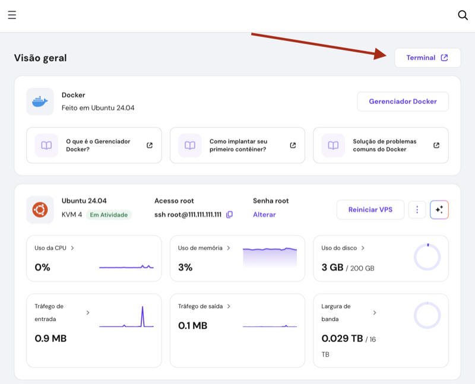

# Guia para o desenvolvedor

Use este guia para aplicar os comandos passo a passo no seu próprio servidor.
Estou usando o [KVM 2 da Hostinger](https://hostinger.com/otaviomiranda), mas
isso deve funcionar em qualquer servidor.

Também detalhei este processo em vídeo caso queira assistir:

[](https://youtu.be/yxxEk68EDgo 'Crie seu próprio cloud em VPS')

- Link: [https://youtu.be/yxxEk68EDgo](https://youtu.be/yxxEk68EDgo)

---

## Onde contratar um servidor?

Se você busca um servidor **robusto, confiável e com preço imbatível**,
recomendo o [KVM 2 da Hostinger](https://hostinger.com/otaviomiranda). Você pode
escolher outros KVMs maiores ou menores conforme a necessidade. No entanto, o
custo benefício do KVM 2 é o melhor (você vai perceber isso por conta própria).

**Bônus Exclusivo:** Consegui **10% de desconto adicional** para vocês. Basta
usar o cupom abaixo no carrinho:

- Cupom: `OTAVIOMIRANDA`

---

## Personalização dos valores

Use seu editor para substituir as chaves à esquerda no bloco de texto abaixo
para os seus dados.

```text
SEU_NOME - Seu nome (Ex.: João da Silva)
SEU_USUARIO_SERVER - Seu nome de usuário para o servidor (Ex.: joaosilva
SEU_EMAIL - Seu e-mail para o certbot (Ex.: joaosilva@email.com)
IP_SERVER - IP do seu VPS (Ex.: 191.27.48.56)
DOMINIO_SERVER - Seu domínio atrelado ao IP do server (Ex.: exemplo.com)
SEU_USUARIO_GITHUB - Seu usuário do GitHub (Ex.: joaozinho)
URL_REPOSITORIO - A URL SSH do seu GitHub (Ex.: git@github.com:user/repo.git)
```

---

## Local

Caso ainda não tenho feito isso, copie o arquivo `.env.example` para `.env` e
modifique os valores como preferir.

Sempre que for desenvolver em ambiente local (seu computador), mantenha a
variável de ambiente `CURRENT_ENV` como `development` no arquivo `.env`. Deixei
instruções no arquivo também.

---

## Como fazer `build` das imagens localmente

Existe um arquivo chamado
[./compose.override.example](compose.override.example). Basta copiá-lo para
`compose.override.yaml`. As configurações feitas no `compose.yaml` são de
produção, já a configurações feitas no `compose.override.yaml` são de
desenvolvimento.

Não é necessário reescrever todo o `compose.override.yaml`, apenas coisas que
você quer sobrescrever. Por exemplo, se estamos fazendo `build` local, não
queremos baixar as imagens do repositório (elas pode nem existir ainda).

---

## Na Hostinger

### Instalação ou reinstalação do sistema operacional

Vou usar o **Ubuntu 24.04 with Docker** da Hostinger. Se quiser seguir
exatamente como estou fazendo, abaixo estão os passos para instalar ou
reinstalar o sistema operacional.

> **Atenção:** reinstalar um sistema operacional novo no servidor significa que
> todos os dados serão apagados do disco. Certifique-se de fazer backup caso
> tenha salvo dados importantes nele.

No menu `VPS` > `SO e Painel` > `Mudar SO` > `SO com Aplicativo`, acesse o campo
de pesquisa e digite `Docker`. Você verá um aplicativo com a logo e nome do
Docker.

Clique neste ícone e depois na opção "Alterar sistema operacional". Como vamos
apagar tudo para instalar um novo sistema operacional, leia atentamente a
mensagem e confirme.

Configure uma senha forte, que você vá se lembrar depois, para o usuário `root`
do seu novo servidor e confirme.

Agora é só aguardar.

---

### Chaves SSH

Por segurança, vamos desativar o acesso por senha e permitir apenas acesso via
SSH.

Para criar seu par de chaves pública e privada use o comando abaixo:

```sh
# NO SEU COMPUTADOR
# Estes comandos funcionam em Linux, Mac e Windows. Mas, dependendo da versão do
# seu Windows, ele pode não ter o OpenSSH. Então, você pode usar
# o PuTTY ou GitBash. Confere os vídeos abaixo:
# https://youtu.be/SnTBOhYFr28?si=ciRshdsvLQODU2oO
ssh-keygen -t ed25519 -f ~/.ssh/id_hostinger -C "${USER}"
```

Nas configurações do seu VPS, acesse `Chaves SSH` > `Adicionar chave SSH`. Copie
o valor do arquivo `~/.ssh/id_hostinger.pub` e cole no campo
`Conteúdo da chave SSH`. Tenha certeza de usar a chave pública (`.pub`), nunca a
chave privada.

```sh
# NO SEU COMPUTADOR
# Exemplo - copie o valor da chave pública
cat ~/.ssh/id_hostinger.pub
```

No Painel da Hostinger, vá em `VPS` > Escolha o VPS e `Gerenciar` >
`Configurações` > `Chaves SSH`. Crie uma chave SSH e cole o valor que você
copiou acima.

Essa chave permite que o usuário `root` acesse o servidor sem senha (vamos
desativar isso depois).

Vamos fazer o primeiro acesso ao servidor, então use este comando no seu
terminal:

```sh
# NO SEU COMPUTADOR
ssh root@DOMINIO_SERVER -i ~/.ssh/id_hostinger
# Ou
ssh root@IP_SERVER -i ~/.ssh/id_hostinger
```

---

## No servidor ou seu computador local

### Atualização e pacotes básicos no servidor

Vamos atualizar tudo e instalar alguns pacotes úteis para o servidor.

```sh
# NO SERVIDOR (Usuário root)
# 🚨 ATENÇÃO: estamos instalando o Fail2ban aqui.
# Evite erra a senha várias vezes.
apt update
apt upgrade -y
apt install -y vim curl ca-certificates htop python3 \
python3-dev acl build-essential ufw fail2ban tree just

# Ajusta o timezone do servidor
# Lista: https://en.wikipedia.org/wiki/List_of_tz_database_time_zones
sudo timedatectl set-timezone America/Sao_Paulo
```

---

### Seu usuário no servidor

Configuramos nosso usuário. Troque `SEU_USUARIO_SERVER` para o nome que deseja
para seu usuário.

```sh
# NO SERVIDOR (Usuário root)
useradd SEU_USUARIO_SERVER -m -s /bin/bash
```

Defina a senha para seu usuário.

```sh
# NO SERVIDOR (Usuário root)
passwd SEU_USUARIO_SERVER
```

Você não precisa fazer isso se não quiser, mas eu gosto de usar o editor vim no
servidor. Se você não tem experiência com isso, troque a palavra `vim` para
`nano`.

```sh
# NO SERVIDOR (Usuário root)
# Escolha o número do editor de sua preferência, eu vou usar o vim
# a outra opção popular é nano. (Mais fácil de usar).
update-alternatives --config editor

# ISSO É OPCIONAL E TENHA CUIDADO (Só use se souber o que está fazendo)
# Isso configura o vim como editor e muda o seu terminal para vi-mode.
# Se não entendeu os comentários acima, pule esses dois comandos abaixo.
curl https://gist.githubusercontent.com/luizomf/9a52ba5b7b43aa69cc9a7121795bb9fa/raw/34d7d9b60e0a0d655cbb2cba8f8d0de8d0238dda/bash_minimal_setup >> ~/.bashrc
curl https://gist.githubusercontent.com/luizomf/9a52ba5b7b43aa69cc9a7121795bb9fa/raw/8db0fd8032a412c95fe7f127b939317dc0f38c0e/.vimrc > ~/.vimrc
source ~/.bashrc
```

Nosso usuário precisa de acesso ao `sudo` para tarefas administrativas. Você tem
duas opções: usar o `sudoers` ou adicionar seu usuário no grupo `sudo`. Vou
adicionar meu usuário no grupo `sudo` (isso só fará efeito depois que você logar
novamente).

```sh
# NO SERVIDOR
usermod -aG sudo SEU_USUARIO_SERVER

# Como o servidor já tem o docker instalado, podemos
# adicionar nosso usuário no grupo do docker
sudo usermod -aG docker SEU_USUARIO_SERVER
```

Faça login com seu usuário.

```sh
# NO SERVIDOR (Usuário root)
# Isso loga com seu usuário
su SEU_USUARIO_SERVER
# Isso vai para a home do seu usuário
cd ~
```

Agora pegamos a chave SSH que jogamos no `root` anteriormente e passamos ela
para nosso usuário.

```sh
# NO SEU COMPUTADOR
# Vai pedir a senha que você acabou de configurar no seu usuário.
ssh-copy-id -i ~/.ssh/id_hostinger.pub SEU_USUARIO_SERVER@DOMINIO_SERVER
# Faça o teste e veja se loga com seu usuário sem senha.
ssh SEU_USUARIO_SERVER@DOMINIO_SERVER -i ~/.ssh/id_hostinger
# ENTROU? Ok, volte para seu terminal normal (seu computador)
exit
```

Para não ter que ficar digitando a chave, usuário e senha, vamos configurar
`~/.ssh/config`.

```sh
# NO SEU COMPUTADOR
# Abra ou crie o arquivo abaixo
vim ~/.ssh/config

###############################################################################
### Início do ~/.ssh/config ###################################################
###############################################################################

# ... Podem existir outros blocos aqui ...

# Cole o bloco abaixo substituindo os valores indicados
Host hostinger
  IgnoreUnknown AddKeysToAgent,UseKeychain
  AddKeysToAgent yes
  HostName DOMINIO_SERVER
  User SEU_USUARIO_SERVER
  Port 22
  IdentityFile ~/.ssh/id_hostinger

# ... Podem existir outros blocos aqui ...

###############################################################################
### Fim do ~/.ssh/config ######################################################
###############################################################################

# Agora o comando é apenas
ssh hostinger
```

Agora você pode remover aquela chave SSH do painel se quiser, não vamos mais
precisar dela.

OPCIONAL - Nós já fizemos isso para o `root`, agora vou fazer o mesmo para meu
usuário. Configurar o `vim` e `vi-mode`. Pode pular esse bloco tranquilamente.

```sh
# NO SERVIDOR (Seu usuário)
# ISSO É OPCIONAL E TENHA CUIDADO (Só use se souber o que está fazendo)
# Isso configura o vim como editor e muda o seu terminal para vi-mode.
# Se não entendeu os comentários acima, pule esses dois comandos abaixo.
curl https://gist.githubusercontent.com/luizomf/9a52ba5b7b43aa69cc9a7121795bb9fa/raw/34d7d9b60e0a0d655cbb2cba8f8d0de8d0238dda/bash_minimal_setup >> ~/.bashrc
curl https://gist.githubusercontent.com/luizomf/9a52ba5b7b43aa69cc9a7121795bb9fa/raw/8db0fd8032a412c95fe7f127b939317dc0f38c0e/.vimrc > ~/.vimrc
source ~/.bashrc
```

---

### Reforçando a segurança para o SSH no servidor

```sh
# NO SERVIDOR (Seu usuário)
# Abra ou crie este arquivo
sudo vim /etc/ssh/sshd_config.d/01_sshd_settings.conf

###############################################################################
### Início do /etc/ssh/sshd_config.d/01_sshd_settings.conf ####################
###############################################################################

# Mínimo recomendável - Eu nunca mudo essas configurações
PubkeyAuthentication yes
PasswordAuthentication no
KbdInteractiveAuthentication no
ChallengeResponseAuthentication no
PermitRootLogin no
PermitEmptyPasswords no
UsePAM no

# Opcional, mas se não preciso de uma coisa, melhor desativar
AuthenticationMethods publickey      # força método = publickey (evita fallback esquisito)
PermitUserEnvironment no             # ignora ~/.ssh/environment (evita injeções de env)
PermitUserRC no                      # desliga ~/.ssh/rc (menos "magia" no login)
X11Forwarding no                     # desliga X11 (quase sempre inútil em servidor)
AllowTcpForwarding no                # fecha tunelamento (pivoteamento)
AllowAgentForwarding no              # fecha agent forwarding (roubo/abuso do agent)
PermitOpen none                      # se forwarding off, fica redundante; deixa explícito
PermitListen none                    # idem (bloqueia reverse forwarding)
GatewayPorts no                      # evita bind remoto "aberto" em reverse tunnels
PermitTunnel no                      # desliga tunelamento L3 (TUN/TAP)

# Não é sobre segurança "hard", mas ajuda um pouco (super opcional)
MaxAuthTries 4                       # diminui tentativas por conexão (default é maior)
LoginGraceTime 30                    # reduz tempo pra autenticar (default 120s)
ClientAliveInterval 300              # mata sessão morta (0 = nunca)
ClientAliveCountMax 2                # junto com acima
PrintMotd no                         # evita motd duplicada em distros
UseDNS no                            # evita delay e lookup reverso

###############################################################################
### Fim do /etc/ssh/sshd_config.d/01_sshd_settings.conf #######################
###############################################################################

# Reinicie o serviço
sudo systemctl restart ssh

# Não feche a conexão ainda. Abra outra aba do terminal e teste
# Faça testes tanto com o root (não deve logar mais, isso é o correto)
# Seu usuário deve logar assim:
ssh hostinger # <- Sem senha, já cai dentro do server

# Se funcionar, beleza. Podemos até reiniciar o servidor com
sudo reboot
```

---

### Configure o git para seu usuário no servidor

Configure o git para evitar erros bobos no futuro.

```sh
# NO SERVIDOR (Seu usuário, não usaremos mais o root)
# Apenas cole os comandos abaixo alterando os dados para os seus
git config --global user.name "SEU_USUARIO_GITHUB"
git config --global user.email "SEU_EMAIL"
git config --global core.autocrlf input
git config --global core.eol lf
git config --global init.defaultbranch main
```

---

### O diretório do projeto no servidor

```sh
# NO SERVIDOR
# Os comandos abaixo criam o diretório onde vamos colocar nosso projeto
sudo mkdir /dockerlabs
sudo chown -R SEU_USUARIO_SERVER:SEU_USUARIO_SERVER /dockerlabs
sudo chmod -R 775 /dockerlabs

# Sem isso o git pode dar erro no deploy
git config --global --add safe.directory /dockerlabs

# Access Control List
# Isso é para evitar que arquivos criados no futuro, tenham as permissões erradas
# 'd' default
# 'g:SEU_USUARIO_SERVER:rwx' adicionar read/write/execute no grupo
# '-R' aplica recursivamente
sudo setfacl -R -m d:g:SEU_USUARIO_SERVER:rwx /dockerlabs
sudo chmod -R 775 /dockerlabs
sudo chmod g+s /dockerlabs
```

---

### Fail2Ban jails - Ainda mais segurança no servidor

O Fail2Ban vai reforçar ainda mais a segurança do nosso SSH. Ele lê logs de
tentativa de login inválidas (geralmente vindas de bots) e bloqueia estes IPs
por um determinado tempo.

- [Fail2Ban - Daemon to ban hosts that cause multiple authentication errors](https://github.com/fail2ban/fail2ban)

```sh
# NO SERVIDOR
# Vamos criar um arquivo de "jail". É nele que vai a configuração do fail2ban.
sudo vim /etc/fail2ban/jail.local

# Só copiar e colar o trecho abaixo

###############################################################################
### INICIO DO /etc/fail2ban/jain.local ########################################
###############################################################################

[DEFAULT]
# Se você sabe o seu IP ou o IP da rede do seu provedor, por favor, adicione
# em ignoreip para evitar ser bloqueado. Exemplo: se meu IP é 188.122.144.171
# Fica assim: ignoreip = 127.0.0.1/8 ::1 188.122.144.171
ignoreip = 127.0.0.1/8 ::1
allowipv6 = auto

[sshd]
enabled  = true
port     = ssh
backend  = systemd

# Aumentei o número de tentativas (eu mesmo fui bloqueado)
maxretry = 5
findtime = 10m
bantime  = 1h

# Aumenta o ban se insistir (Progressão geométrica)
bantime.increment = true
bantime.factor    = 2
bantime.max       = 24h

###############################################################################
### FIM DO /etc/fail2ban/jail.local ###########################################
###############################################################################

# Salve o arquivo e reinicie o serviço
sudo systemctl restart fail2ban
```

---

#### 🚨 FUI BLOQUEADO - SERVIDOR PAROU DE RESPONDER

Estou adicionando esse trecho aqui justamente por ter acontecido comigo. Estava
testando configurações e o servidor parou de responder inesperadamente. Você vai
pensar em todos os motivos possíveis para o problema: sua Internet, a Hostinger,
seu servidor, seu domínio, etc. Mas, na grande maioria das vezes é o Fail2Ban.

Se você errar a senha mais de 5 vezes, será bloqueado (isso porque aumentei,
estava 1x apenas). Ele libera automaticamente após 1 hora.

Claro que você não precisa esperar uma hora. Vá no seu painel da Hostinger
(hpanel), **VPS**, **Gerenciar**. Bem no topo existe um botão `Terminal`. Clique
nele e faça login com o `root` (se não lembrar a senha, vá em "Configurações" e
altere).



Devidamente logado, pare o serviço do Fail2Ban e teste para ver se volta a logar
do seu computador local.

```sh
# Sem sudo porque já estamos como root, do contrário use:
# sudo systemctl stop fail2ban
systemctl stop fail2ban

# Se quiser iniciar de novo o serviço
systemctl start fail2ban
```

Se voltar era ele mesmo. Deixo um pequeno guia para que você gerencie os IPs
banidos pelo Fail2Ban. Mas, considere usar apenas chaves SSH. Login por senha é
menos seguro e está vulnerável a ataques de brute force. Além disso, considere
adicionar o seu IP ou a rede do seu provedor (se possível) em `ignoreips`.

---

#### Manual básico do Fail2Ban para o dia a dia (Cheat Sheet)

```sh
# VERIFICAR STATUS

# Ver o status geral (quais jails estão ativas)
sudo fail2ban-client status

# Ver estatísticas do SSH (quantos banidos, lista de IPs, etc.)
# Nota: 'sshd' é o nome da jail definida no arquivo .local
sudo fail2ban-client status sshd

# "DESBANIR" (UNBAN)
# Caso você ou um colega tenha sido bloqueado sem querer.

# Sintaxe: fail2ban-client set <NOME_DA_JAIL> unbanip <IP>
sudo fail2ban-client set sshd unbanip 192.168.1.50

# Dica: Se quiser "desbanir" todo mundo (limpar a lista)
sudo fail2ban-client unban --all

# BANIR MANUALMENTE
# Viu um IP suspeito nos logs e quer bloquear agora?

# Sintaxe: fail2ban-client set <NOME_DA_JAIL> banip <IP>
sudo fail2ban-client set sshd banip 203.0.113.45

# MONITORAMENTO (LOGS)

# Ver o que o Fail2Ban está fazendo em tempo real
sudo journalctl -f -u fail2ban

# Ver quem está tentando logar no SSH (erros de senha)
sudo journalctl -f -u ssh

# Para o serviço do Fail2Ban
sudo systemctl stop fail2ban

# Inicia o serviço do Fail2Ban
sudo systemctl start fail2ban
```

### UFW - Firewall Simples

A Hostinger tem um firewall na rede. É aconselhável ativá-lo. Mas também vamos
ativar o firewall em nosso próprio servidor.

```sh
# NO SERVIDOR
# A configuração recomendada é bloquear tudo e liberar o que precisarmos
sudo ufw default deny incoming
sudo ufw default allow outgoing

# Isso é importante, estamos conectados via SSH. Precisamos disso.
sudo ufw allow ssh

# Também vamos precisar de HTTP e HTTPS
sudo ufw allow 80/tcp
sudo ufw allow 443/tcp

# Ative o firewall.
# Ele vai te alertar que você poderia derrubar as conexões, mas já ativamos
# o ssh.
sudo ufw enable
sudo ufw status
sudo ufw status verbose
```

---

### Clone o repository no servidor

Precisamos clonar o repositório do projeto. Os comandos abaixo vão ajudar com
isso.

É interessante que você faça um fork do projeto para sua conta, estou usando a
minha.

```sh
# NO SERVIDOR
# O primeiro par de chaves SSH que criamos foi nesse sentido
# -> Nosso computador -> Hostinger
# Agora precisamos de outro par nesse sentido:
# -> Hostinger -> Nosso repositório (github)
# Isso deve ser feito no servidor
ssh-keygen -t ed25519 -a 100 -f ~/.ssh/repository -C "${USER}"

# Copie a chave pública
cat ~/.ssh/repository.pub

# NO GITHUB (Repositório > Settings ou use as chaves do seu usuário se preferir)
# No repositório, vá em Settings > Deploy Keys
# Crie e Cole a chave pública

# NO SERVIDOR
# Abra ~/.ssh/config
vim ~/.ssh/config

###############################################################################
### Início do ~/.ssh/config ###################################################
###############################################################################

# ... Podem existir outros blocos aqui ...

# Cole o seguinte
Host github.com
  IgnoreUnknown AddKeysToAgent,UseKeychain
  AddKeysToAgent yes
  HostName github.com
  User git
  Port 22
  IdentityFile ~/.ssh/repository

# ... Podem existir outros blocos aqui ...

###############################################################################
### Fim do ~/.ssh/config ######################################################
###############################################################################

# Adicione o github no known_hosts
ssh-keyscan github.com >> ~/.ssh/known_hosts
```

Agora é só clonar o repositório

```sh
# NO SERVIDOR
cd /dockerlabs
git clone URL_REPOSITORIO . # <- O ponto é importante aqui
```

---

### GHCR - GitHub Container Registry

Se o seu repositório for privado, você vai precisar criar um **PAT** Classic
(Personal Access Token) para baixar as imagens do Docker.

No seu perfil, acesse `Settings`, `Developer Settings` e crie o novo **PAT**
classic com as permissões `read:packages`.

Copie o token e digite o seguinte no server.

```sh
# NO SERVIDOR
echo "COLE_O_TOKEN_AQUI" | docker login ghcr.io -u SEU_USUARIO_GITHUB --password-stdin
# Isso deve alertar que o token ficará visível. Mas não tenho problemas com isso.
# Se seu servidor for invadido, isso não será seu maior problema (vai por mim).
```

---

## Subindo o projeto no servidor

### Copie o `.env.example` para `.env`

Ajuste o `.env` do projeto.

```sh
# NO SERVIDOR
cd /dockerlabs

# Gere um secret para nosso webhook e copie
# Adicione no .env em GITHUB_WEBHOOK_SECRET
python3 -c "import secrets; print(secrets.token_hex(32))"

cp .env.example .env
# Abra o arquivo e configure tudo.
vim .env
# Mantenha o CURRENT_ENV como development por agora.
```

Confira duas ou três vezes, porque editar o `.env` depois que a imagem está
pronta é bem chato.

---

### As imagens no `compose.yaml`

🚨 ATENÇÃO AQUI - Se você errar a URL das imagens não vai funcionar.

O arquivo do docker `compose.yaml` está configurado para o meu próprio
repositório. Abra este arquivo e altere todas as imagens para o seu nome de
usuário no GitHub.

Você pode obter as novas urls no seu repositório, em `Packages`. Ou você também
poderia usar outro registry qualquer, mas aí mudaria outras coisas também (como
nosso GitHub Actions).

```yaml
services:
  data_vol:
    # No seu repositório, vá em packages e pegue a URL para a imagem data_vol
    # Troque a imagem abaixo para a sua (se não, não vai funcionar)
    image: ghcr.io/luizomf/dockerlabs_pri_hostinger1-data_vol:latest
  # ... várias outras configs

  dockerlabs:
    pull_policy: always
    # No seu repositório, vá em packages e pegue a URL para a imagem dockerlabs
    # Troque a imagem abaixo para a sua (se não, não vai funcionar)
    image: ghcr.io/luizomf/dockerlabs_pri_hostinger1-dockerlabs:latest
  # ... várias outras configs

  nginx:
    container_name: nginx
    hostname: nginx
    pull_policy: always
    # No seu repositório, vá em packages e pegue a URL para a imagem nginx
    # Troque a imagem abaixo para a sua (se não, não vai funcionar)
    image: ghcr.io/luizomf/dockerlabs_pri_hostinger1-nginx:latest
  # ... várias outras configs

  certbot:
    container_name: certbot
    hostname: certbot
    pull_policy: always
    # No seu repositório, vá em packages e pegue a URL para a imagem certbot
    # Troque a imagem abaixo para a sua (se não, não vai funcionar)
    image: ghcr.io/luizomf/dockerlabs_pri_hostinger1-certbot:latest

  # ... várias outras configs
```

Salve o arquivo e reserve, vamos cozinhar outras coisas para usar isso depois.

---

### Bootstrap `development` (primeira vez)

Configure mais uma vez o `.env`, mantenha o `CURRENT_ENV` como `development`
para testes iniciais. E execute o seguinte script.

```sh
# NO SERVIDOR
# Isso pode dar erro de permissão. Nós já fizemos isso, mas garanta que:
# - Você tem o docker instalado (nós instalamos um sistema que já vem com ele)
# - Seu usuário está no grupo docker, comando: sudo usermod -aG docker SEU_USUARIO_SERVER
cd /dockerlabs
/dockerlabs/data/scripts/bootstrap
```

---

### Bootstrap `production` (segunda e última vez)

Depois que tudo funcionar em `development`, mude `CURRENT_ENV` para `production`
e execute novamente.

🚨 Aqui você precisa ter absoluta certeza que tudo está certo no `.env`,
principalmente seu(s) domínio(s).

Os certificados SSl serão gerados pelo certbot.

```sh
cd /dockerlabs
/dockerlabs/data/scripts/bootstrap
```

---

### Watcher no servidor

Vamos criar um serviço para ler arquivos que a `FastAPI` salvar em uma pasta.

Execute o seguinte:

```sh
# Crie o arquivo do serviço
sudo vim /etc/systemd/system/webhook-watcher.service

###############################################################################
### Início do /etc/systemd/system/webhook-watcher.service #####################
###############################################################################

[Unit]
Description=Webhook Watcher for Docker Deployment
After=network.target

[Service]
Type=simple
WorkingDirectory=/dockerlabs/
ExecStart=/dockerlabs/data/scripts/watcher
Restart=always
RestartSec=3
User=SEU_USUARIO_SERVER
Group=SEU_USUARIO_SERVER

[Install]
WantedBy=multi-user.target

###############################################################################
### Fim do /etc/systemd/system/webhook-watcher.service ########################
###############################################################################

# Agora execute os comandos abaixo em ordem
sudo systemctl daemon-reload
sudo systemctl enable webhook-watcher
sudo systemctl start webhook-watcher
sudo systemctl status webhook-watcher

# # Se precisar remover este serviço por algum motivo, use
# # os comandos abaixo.
# sudo systemctl stop webhook-watcher
# sudo systemctl disable webhook-watcher
# sudo rm /etc/systemd/system/webhook-watcher.service
# sudo systemctl daemon-reload
# # Se insistir em não apagar
# sudo systemctl reset-failed

# Para ver os logs
sudo journalctl -u webhook-watcher.service -f
```

---

## GitHub Action

A `FastAPI` precisará de um secret. Nós geramos um lá no começo deste texto e
adicionamos no `.env`. Esses secrets precisam estar no repositório.

Acesse `Settings` > `Secrets and variables` > `New Repository Secret`.

Crie esses secrets:

- `DEPLOY_WEBHOOK_URL` - https://DOMINIO_SERVER/webhook/github
- `DEPLOY_WEBHOOK_SECRET` - Cole o `GITHUB_WEBHOOK_SECRET` do `.env` (mesmo
  valor)

Se tudo estiver correto, ao fazer push para o branch `main`, os testes da
aplicação serão executados, as builds de imagens do Docker serão criadas no GHCR
e o `webhook` será chamado para alertar o servidor que existe um deploy para ser
feito.

---
